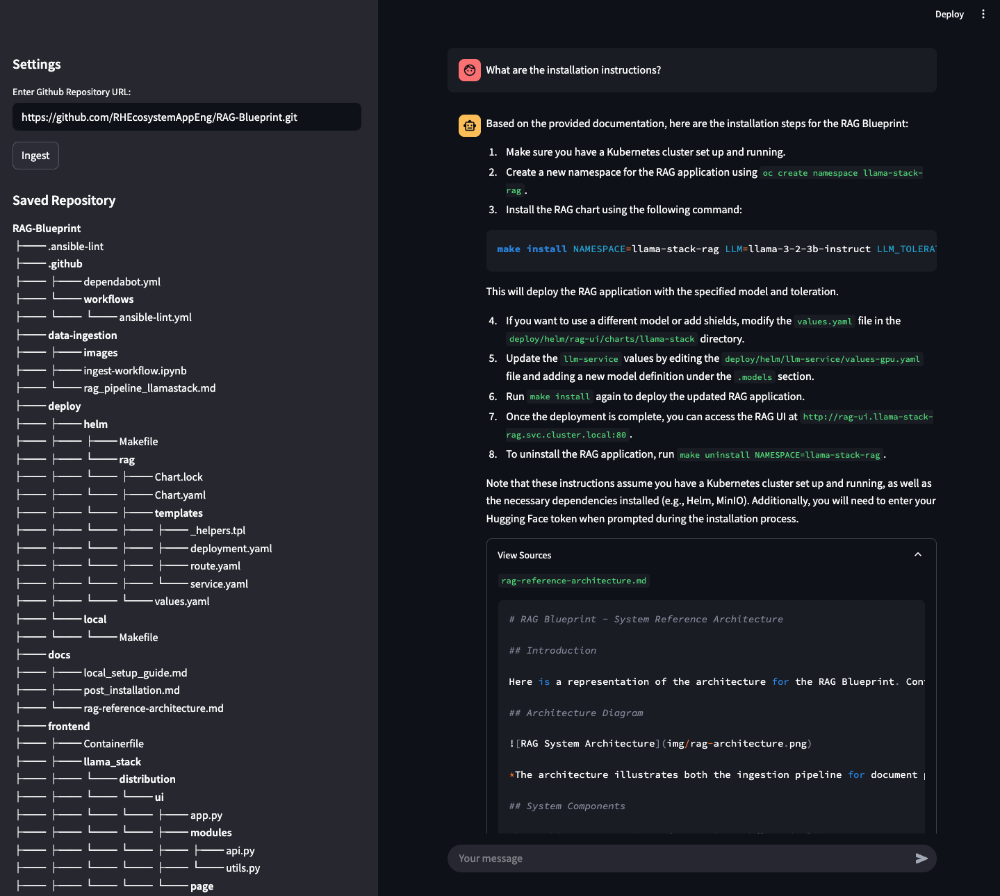
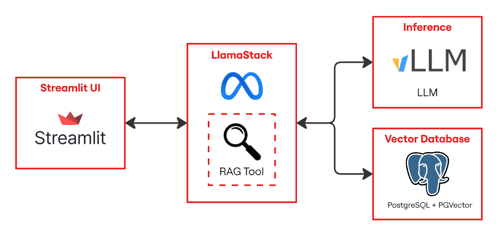

# RAG Assistant for Github Repositories

[Design Document](https://docs.google.com/document/d/1Bo_BkGSxWiDNKUSwEG-GPFBL6swkyRGxIxlsVxe085k/edit?usp=sharing)

This application provides an interactive chatbot interface to analyze and ask questions about a specific GitHub repository. 

It helps teams understand and adapt to large and unfamiliar codebases by offering specialized insight into repositories.

To get this running, jump straight to [installation](#install). 

## Description 
A chat assistant that allows users to ask questions about a GitHub repo (e.g., “How do I deploy this?” or “Explain this function”), using RAG (Retrieval-Augmented Generation) with LLMs.

**What is RAG?** RAG enhances LLMs by retrieving relevant information from an external knowledge base to ground its responses, making them more accurate and up-to-date.

## Features
- Chat assistant with memory and knowledge of provided repository
- Sources tab to view referenced files
- Detailed directory tree visualization

## See it in action 



## Architecture



- **Streamlit App**: Chat interface, repository visualization
- **Llamastack**: API layer for agents, tooling, and vector IO 
- **LLM**: Deployed on OpenShift AI
- **PostgreSQL + PGVector**: Stores embeddings and performs similarity search for RAG

## Requirements

Ollama installed with the `minilm` and `llama3.1:8b-instruct-fp16` models:
```sh
ollama pull all-minilm
ollama pull llama3.1:8b-instruct-fp16
```

---
This kicktart supports two modes of deployments:
- Local
- Openshift

## Openshift Installation

#### Prerequisites
- OpenShift Cluster 4.16+ with OpenShift AI
- OpenShift Client CLI - `oc`
- Helm CLI - `helm`
- 1 GPU with 24GB of VRAM for the LLM
- Hugging face Token
- Access to Meta Llama model
- Installed `yq`

#### Installation Steps
1. Login to your OpenShift Cluster

```bash
oc login --server="<cluster-api-endpoint>" --token="sha256~XYZ"
```

2. If the GPU nodes are tainted, find the taint key. You will have to pass in the
   make command to ensure that the llm pods are deployed on the tainted nodes with GPU.
   In the example below the key for the taint is `nvidia.com/gpu`


```bash
oc get nodes -o yaml | grep -A 3 taint
```
The output of the command will be something like below
```
  taints:
    - effect: NoSchedule
      key: nvidia.com/gpu
      value: "true"
--
    taints:
    - effect: NoSchedule
      key: nvidia.com/gpu
      value: "true"
```

You can work with your OpenShift cluster admin team to determine what labels and taints identify GPU-enabled worker nodes.  It is also possible that all your worker nodes have GPUs therefore have no distinguishing taint.

3. Navigate to Helm deploy directory

```bash
cd deploy/helm
```

4. Run the install command
```bash
make install NAMESPACE=github-rag-assistant LLM=llama-3-2-3b-instruct LLM_TOLERATION="nvidia.com/gpu" 
```

5. Access the route once all services have been deployed to access the Streamlit UI

```bash
oc get route
```

## Local Deployment using Ollama
Note that the local deployment uses an in-memory FAISS database instead of PostgreSQL + PGVector. This is configured in the default Llamastack Ollama template.

1. Make sure that `uv` is installed

```bash
uv --version
```

If not, install using `pip`

```bash
pip install uv
```

2. Install the dependencies

```bash
uv sync
```

3. Make sure Ollama is running

```bash
ollama run llama3.1:8b-instruct-fp16 # Or start the Ollama application
```

4. Start the LlamaStack server

```bash
source .venv/bin/activate
INFERENCE_MODEL=llama3.1:8b-instruct-fp16 llama stack build --template ollama --image-type venv --run
```

4. Run the Streamlit app
```bash
uv run streamlit run app.py
```

---
Helm Chart designs adapted from [RAG Blueprint](https://github.com/rh-ai-kickstart/RAG)